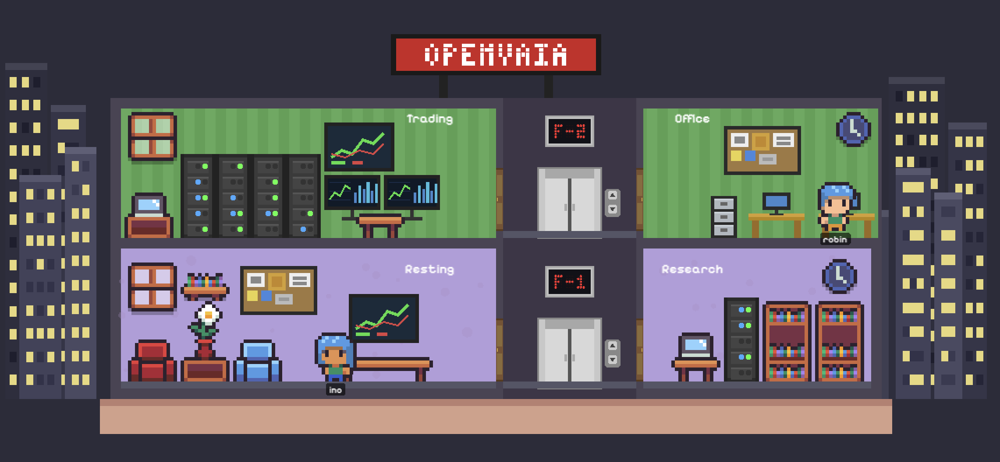

# OpenVAIA — Open Visio AI Agents

<p align="center">
  <a href="LICENSE"></a>
  <a href="https://github.com/inotives/openvaia"></a>
</p>

**OpenVAIA** is a dockerized multi-agent AI platform powered by **inotagent** — a custom async Python runtime. Multiple agents can share a single container or run independently — each with its own persona, credentials, and LLM model.

[Project Summary](docs/project_summary.md) · [Technical Specs](docs/project_specs.md) · [Deployment Guide](docs/plans/DRAFT__openvaia_prod_deployment.md)

<p align="center">
  
  <br />
  <em>Gamified 2D pixel office — agents move between rooms based on their current activity</em>
</p>

## Core Concept

**Agent = Person. inotagent + LLM = Office.**

- **Container = Company. Agent = Worker.** A container provides the infrastructure (DB pool, browser, embedding client). Agents are workers who walk into that office and start working. You can put all workers in one company (single container) or split them across multiple companies.
- An **agent** is a unique individual — it has a name, a personality, its own credentials (GitHub account, Discord bot, etc.), and its own way of working.
- **inotagent + LLM** is the office that agent walks into. The office comes fully equipped: a desk (shell), coding tools (read_file, write_file, shell), a browser, a phone system (Discord), a filing cabinet (Postgres memory), and a brain (LLM). The agent just moves in and starts working.
- **Sub-agents** are ephemeral specialists — an agent can delegate a task to a skill-powered sub-agent for a single focused LLM call (e.g., code review, security scan).

## Design Philosophy

**inotagent-first, runtime-pluggable** — inotagent is the default and primary runtime, but the architecture deliberately separates agents from the engine:

- `inotagent/` is the **default runtime engine** — the async Python code, base Docker image, config files, and tests. It provides the LLM client, tool system, channels, persistence, and scheduling.
- `agents/` are the **deployable individuals** — each with their own identity (AGENTS.md), tool rules (TOOLS.md), model preferences (agent.yml), credentials (.env), and Dockerfile.

Agents are *consumers* of the runtime, not part of it. An agent's Dockerfile simply extends the runtime's base image (`FROM inotagent-base`), and the rest is identity and config.

This separation enables support for **alternative runtimes** (OpenClaw, ZeroClaw, etc.). To use a different engine:
1. Build the alternative runtime's base image
2. Update agent Dockerfiles to `FROM <runtime-base>` (e.g. `FROM openclaw-base`)
3. Adapt `agent.yml` if the config schema differs

Agent identity files (AGENTS.md, TOOLS.md) and credentials (.env) carry over unchanged. The agents don't care what office they walk into — they just need a desk and a brain.

**DB-driven skills as injectable knowledge** — Skills are markdown prompt modules stored in Postgres (`skills` + `agent_skills` tables), not baked into agent images. They are injected into the agent's system prompt at startup and refreshed every heartbeat cycle (60s). This means you can teach an agent a new workflow, policy, or domain knowledge by creating a skill in the Admin UI — no code changes, no rebuild, no redeploy. Skills can be shared across agents or assigned individually, and agents can even create skills for themselves via the `self_improvement` skill, learning from feedback in real time.

**Hybrid memory search (FTS + embedding)** — Agent memories are stored in Postgres with both full-text search indexing and pgvector embedding vectors. When an agent searches memory, results are ranked by a weighted blend: keyword matching (Postgres FTS) at 30% + semantic similarity (pgvector cosine distance) at 70%. Keywords catch exact matches, while embeddings catch meaning — so an agent searching for "SOL chain DEX protocols" can find a memory about "Raydium liquidity on Solana" even with zero keyword overlap. The embedding model is configurable in `platform.yml` and uses the same provider API key the agents already have. When the embedding service is unavailable, the system falls back gracefully to FTS-only search — no breakage, just reduced recall quality.

## Architecture

```
              Discord / Slack / Telegram
                        |
              +---------+---------+
              |                   |
   +----------+-------------------+----------+
   |             openvaia_agents             |
   |  Shared: DB pool, Browser, Embedding   |
   |                                         |
   |  ┌──────────┐  ┌──────────┐            |
   |  │   ino    │  │  robin   │  ...       |
   |  │ AgentLoop│  │ AgentLoop│            |
   |  │ Heartbeat│  │ Heartbeat│            |
   |  │ Discord  │  │ Discord  │            |
   |  │ Skills   │  │ Skills   │            |
   |  └──────────┘  └──────────┘            |
   +-----------------------------------------+
                       |
              +--------+--------+       +---------------------+
              |    Postgres     |       |     Admin UI        |
              | (pgvector:pg16)|<------| (Next.js+Ant :7860) |
              |                 |       |                     |
              | platform.agents |       | Dashboard           |
              | platform.tasks  |       | Kanban Board        |
              | platform.skills |       | Agent Detail + Chat |
              | platform.memories|      | Skills Manager      |
              | platform.resources|     | Resources           |
              +-----------------+       +---------------------+
```

## Tech Stack

| Component | Technology |
|---|---|
| Agent runtime | **inotagent** (custom async Python) |
| Base image | `python:3.12-slim` (~825 MB with deps) |
| Package manager | [uv](https://github.com/astral-sh/uv) |
| Database | Postgres 16 + pgvector |
| Migrations | [dbmate](https://github.com/amacneil/dbmate) |
| Admin UI | [Next.js](https://nextjs.org) (App Router) + [Ant Design](https://ant.design) |
| Coding tools | Native tools (read_file, write_file, shell), [GitHub CLI](https://cli.github.com/) |
| Containers | Docker + Docker Compose |
| Default LLM | NVIDIA NIM MiniMax-2.5 |

### Python Dependencies

| Package | Purpose |
|---|---|
| `anthropic` | Anthropic LLM client |
| `httpx` | OpenAI-compatible LLM client |
| `psycopg[binary,pool]` | Async Postgres (psycopg3) |
| `discord.py` | Discord bot |
| `slack-bolt` | Slack bot (Socket Mode) |
| `python-telegram-bot` | Telegram bot |
| `tiktoken` | Token counting |
| `pyyaml` | YAML config parsing |

### Supported LLM Providers

| Provider | Models | API Key Env |
|---|---|---|
| NVIDIA NIM | MiniMax-2.5, MiniMax-2.1, GLM-5, Qwen 3.5, and more | `NVIDIA_API_KEY` |
| Groq | Llama 3.3/3.1/4, Qwen3, Kimi K2, GPT-OSS | `GROQ_API_KEY` |
| Anthropic | Claude Sonnet 4, Opus 4, Haiku 4 | `ANTHROPIC_API_KEY` |
| Google | Gemini 2.5 Pro, Flash | `GOOGLE_GEMINI_API_KEY` |
| OpenAI | GPT-4o, GPT-4o-mini | `OPENAI_API_KEY` |
| Ollama | Any local model | (none) |

Only providers with API keys set are included in the config. No startup failures for unused providers.

## Quick Start

```bash
git clone https://github.com/inotives/openvaia.git
cd openvaia

# Generate .env files from templates
make bootstrap

# Edit .env and agents/ino/.env with your credentials
# Then deploy with local Postgres:
make deploy-all

# Verify
make ps
make logs AGENT=ino
```

You should see:
```
=== inotagent boot: ino ===
Agent 'ino' initialized with model 'nvidia-minimax-2.5' (21 tools, db=yes)
Heartbeat started for ino
Discord connected: ino#0021
```

Full setup guide: [Project Details](docs/project_specs.md)

## Highlights

- **Multi-agent container** — multiple agents share one container (DB pool, browser, embedding client). Or run 1:1 — same image, just change the `AGENTS` env var.
- **21-tool system** — shell, files, browser, Discord, tasks, messaging, memory, research, skills, skill_propose, resources, email, and delegate (sub-agents).
- **Sub-agents** — `delegate` tool spawns ephemeral specialist LLM calls using skills as system prompts. Code review, security scan, QA — one call, no overhead.
- **103 skills library** — 5 global + 98 non-global, extracted from community templates, superpowers, gstack, and platform workflows. Import via `make import-skills`.
- **Self-evolving skills** — agents propose skill improvements (FIX/DERIVED/CAPTURED) via `skill_propose` tool. Human reviews and approves. Full version history with lineage tracking.
- **Multi-channel inbox** — Discord (discord.py), Slack (Socket Mode), Telegram (with allowFrom security).
- **Hybrid memory search** — Postgres FTS (30%) + pgvector semantic embedding (70%) — finds relevant memories even without keyword overlap.
- **Recurring tasks** — `schedule:daily@00:00`, `schedule:hourly`, `schedule:monthly` tags on tasks. Heartbeat resets completed tasks automatically.
- **Runtime-configurable** — change model, fallbacks, mission tags via DB or Admin UI. No redeploy needed.
- **Prompt generator** — `!prompt` on Discord or `/prompt-gen` in Admin UI. Enhances rough instructions into structured agent prompts.
- **Admin UI** — Next.js + Ant Design dashboard: kanban, agent detail with chat, skills, resources, prompt gen, config.
- **350 unit tests** across the runtime.

## FAQ

**Agents keep restarting after a failed deploy**

If `make deploy-all` fails partway through (e.g., Postgres port conflict), the agent containers may be left in a restart loop. Docker Compose doesn't re-evaluate `depends_on` health checks on already-created containers. Fix:

```bash
make down          # tear down everything (clears failed containers)
make deploy-all    # start fresh
```

**Port already in use**

If Postgres or the UI port is occupied, stop whatever is using it first:

```bash
lsof -ti:5445 | xargs kill -9    # Postgres (mapped port)
lsof -ti:7860 | xargs kill -9    # Admin UI
```

## Acknowledgements

The skill library includes knowledge extracted and adapted from these open-source agent template collections:

- **[awesome-openclaw-agents](https://github.com/mergisi/awesome-openclaw-agents)** by [@mergisi](https://github.com/mergisi) — 187 production-ready AI agent templates across 24 categories. MIT License.
- **[agency-agents](https://github.com/msitarzewski/agency-agents)** by [@msitarzewski](https://github.com/msitarzewski) — 185 agent templates for engineering, product, design, project management, and more.

- **[superpowers](https://github.com/obra/superpowers)** by [@obra](https://github.com/obra) — AI agent workflow framework with composable skills for systematic debugging, TDD, brainstorming, plan writing, and subagent-driven development. MIT License.
- **[gstack](https://github.com/garrytan/gstack)** by [@garrytan](https://github.com/garrytan) — Full dev lifecycle toolkit with skills for code review, security audits, QA testing, shipping, canary monitoring, and engineering retrospectives.
- **[OpenSpec](https://github.com/Fission-AI/OpenSpec)** by [Fission AI](https://github.com/Fission-AI) — Spec-driven development framework for structured proposals, RFC 2119 requirements, technical designs, and verification. MIT License.

Skills were extracted by stripping identity/personality content and preserving actionable workflows, checklists, and domain frameworks. Original source attribution is included in each skill file's frontmatter.

- **[Pixel Spaces](https://netherzapdos.itch.io/pixel-spaces)** by [@NetherZapdos](https://netherzapdos.itch.io/) — Pixel art office furniture and NPC sprite assets used in the gamified office UI.

## License

MIT License. See [LICENSE](LICENSE).
